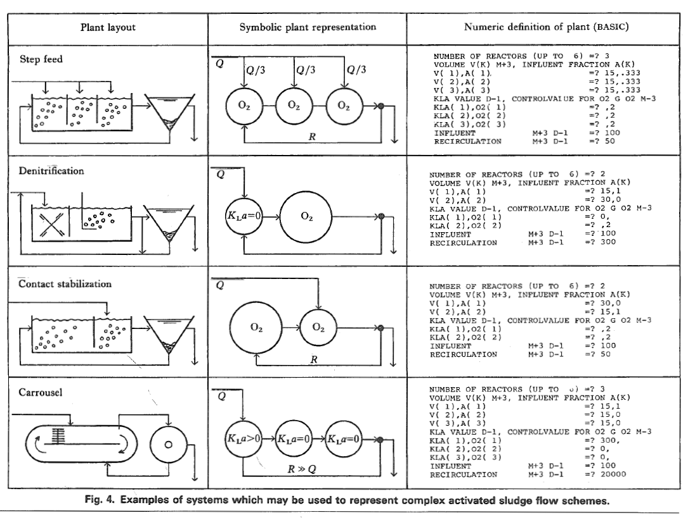

---
hide:
  - navigation
---

# BMS2-Python user guide

This guide provides an overview and explains how to set up your own BSM2-Python project.


## What is BSM2-Python?

BSM2-Python is an implementation of a wastewater treatment plant using the [Benchmark Simulation Model No. 2],
which is extended with an energy management system that operates the plant's energy processes. BSM2-Python can be used to
fully display a real-world wastewater treatment plant to simulate and run techno-economic analyses. It is possible to
modify the predefined BSM2-Python layout by adding, removing or modifying units of BSM2-Python to build a
customized plant layout.

The following figure illustrates the flowchart for wastewater treatment and energy management.
Initially, wastewater flows into the primary clarifier, where excess sewage sludge is removed. Next, the wastewater flow
undergoes treatment in five activated sludge reactors. The treated effluent is then fed into a settler, where any
remaining sewage sludge is removed.
The sludge collected in the settler is compressed in a thickener, separating excess wastewater, which is returned to the
treatment process. In the anaerobic digester, sewage gas is produced and subsequently stored in a biogas storage.
The fully fermented sewage sludge is drained in the dewatering unit and then disposed of. Excess wastewater is held in a wastewater storage tank and recycled back to the wastewater treatment processes.
In the energy management system, the sewage gas is utilized in two combined heat and power (CHP) units to generate
electricity for the aeration in the activated sludge reactors and heat for the anaerobic digester. If the heat generated
by the CHP units is insufficient, additional sewage gas is burned in a boiler. When sewage gas production exceeds the
storage capacity, the surplus is burned off with a flare. To regulate the heat network, a cooler is used to
dissipate any excess heat.

<figure markdown="span">
  
  <figcaption>BSM2 Flowchart</figcaption>
</figure>

---

## BSM2-Python components

Further details about the components used for wastewater treatment and energy management are provided in the section below.

### Wastewater treatment components

<div class="grid" markdown>

:bsm2python-primary-clarifier: __[Primary clarifier](/user_guide/bsm2_python_components/wwt_components/primary_clarifier/)__
{ .card }

:bsm2python-activated-sludge-reactor: __[Activated sludge reactor](/user_guide/bsm2_python_components/wwt_components/activated_sludge_reactor/)__
{ .card }

:bsm2python-settler: __[Settler](/user_guide/bsm2_python_components/wwt_components/settler/)__
{ .card }

:bsm2python-thickener: __[Thickener](/user_guide/bsm2_python_components/wwt_components/thickener/)__
{ .card }

:bsm2python-anerobic-digester: __[Anaerobic digester](/user_guide/bsm2_python_components/wwt_components/anaerobic_digester/)__
{ .card }

:bsm2python-dewatering: __[Dewatering](/user_guide/bsm2_python_components/wwt_components/dewatering/)__
{ .card }

:bsm2python-wastewater-storage: __[Wastewater storage](/user_guide/bsm2_python_components/wwt_components/wastewater_storage/)__
{ .card }

:material-call-merge: :material-call-split: __[Combiner and Splitter](/user_guide/bsm2_python_components/wwt_components/combiner_and_splitter/)__
{ .card }

:bsm2python-aerationcontrol: __[Aeration control](/user_guide/bsm2_python_components/wwt_components/aerationcontrol/)__
{ .card }
</div>


### Energy management components

<div class="grid" markdown>

:bsm2python-biogas-storage: __[Biogas storage](/user_guide/bsm2_python_components/em_components/biogas_storage/)__
{ .card }

:bsm2python-chp: __[Combined heat and power unit](/user_guide/bsm2_python_components/em_components/chp/)__
{ .card }

:bsm2python-boiler: __[Boiler](/user_guide/bsm2_python_components/em_components/boiler/)__
{ .card }

:bsm2python-flare: __[Flare](/user_guide/bsm2_python_components/em_components/flare/)__
{ .card }

:bsm2python-cooler: __[Cooler](/user_guide/bsm2_python_components/em_components/cooler/)__
{ .card }

:material-heating-coil: __[Heating network](/user_guide/bsm2_python_components/em_components/heat_net/)__
{ .card }

:material-arrow-collapse: __[Compressor](/user_guide/bsm2_python_components/em_components/compressor/)__
{ .card }

:material-transit-connection-horizontal: __[Fermenter interface](/user_guide/bsm2_python_components/em_components/fermenter_interface/)__
{ .card }

:material-cube: __[Module](/user_guide/bsm2_python_components/em_components/module/)__
{ .card }

:material-calculator: __[Economics](/user_guide/bsm2_python_components/em_components/economics/)__
{ .card }
</div>

---

## Quickstart

### Run default model

You can use the following convenience function:

```python
from bsm2_python import BSM2OL

# initialize the BSM2 Open Loop model
bsm2_ol = BSM2OL()

# run the simulation
bsm2_ol.simulate()
```

This will run the BSM2 Open Loop model for the default 609 days of simulation time.
It will then plot IQI, EQI and OCI values for the effluent over the last few days of simulation.
Additionally, relevant data will be saved to `data/output_evaluation.csv` for further analysis.


### Run with custom aeration

You can also run the BSM2 models with your own aeration control.
This example selects a random kla value for each reactor every timestep.
The final performance is saved in the `oci` variable:

```python
import numpy as np
from bsm2_python import BSM2OL
from tqdm import tqdm


bsm2_ol = BSM2OL()

# The kla values to choose from
select_klas = np.array([0, 60, 120, 180, 240])

for idx, _ in enumerate(tqdm(bsm2_ol.simtime)):
    # select random klas for all five ASM1 reactors
    klas = np.random.choice(select_klas, 5)

    # make a step in the simulation with the specified kla values
    bsm2_ol.step(idx, klas)


oci = bsm2_ol.get_final_performance()[-1]
```


### Run Closed Loop simulation with custom DO setpoint
You can also run the BSM2 Closed Loop model with your own dissolved oxygen (DO) setpoints.
Please note: The Closed Loop model runs with a resolution of 1 minute to ensure sensor stability. 
As a result, the simulation might take a while to complete.

```python
from bsm2_python import BSM2CL
from tqdm import tqdm


bsm2_cl = BSM2CL()

# The custom DO setpoint for the BSM2 default aeration control
so4_ref = 1.5

for idx, _ in enumerate(tqdm(bsm2_cl.simtime)):
    bsm2_cl.step(idx, so4_ref)

# get the final performance of the plant
oci = bsm2_cl.get_final_performance()[-1]
```


### Run with energy management model
We introduced a simple energy management model (including CHPs, Boilers, Flares and a small techno-economic analysis)
that can be used to simulate the energy consumption and production of the plant.

```python
from bsm2_python import BSM2OLEM

bsm2_olem = BSM2OLEM()

bsm2_olem.simulate()

# get the cumulated cash flow of the plant
cash_flow = bsm2_olem.economics.cum_cash_flow
```

---

## Short documentation of the simulation

A basic simulation (with energy management) in this project always consists of the following steps:

1. Initialization

2. Simulation loop

    - Stabilization of wastewater treatment plant (WWTP)

    - Simulate WWTP

    - Collect data from WWTP

    - Simulate energy management (EM)

    - Collect data from EM

3. Evaluation

A detailed documentation of the BSM2-base module can be found below:

<div class="grid" markdown>

:bsm2python-settler: __[Bsm2-base plant documentation](bsm2_base.md)__
{ .card }


</div>

---

<!-- ## Build a customized BSM2-Python plant layout

Both the wastewater treatment plant layout as well as the energy management layout can be customized by adding, removing or modifying individual process units. To customize the wastewater treatment plant layout the module [`bsm2_base.py`](/reference/bsm2_python/bsm2_base) has to be changed. For the customization of the energy management layout change the module [`bsm2_olem.py`](/reference/bsm2_python/bsm2_olem).

### Examples for activated sludge flow schemes




### Adding a process unit to the plant layout

z.B. asm1 reaktor 6

1. Initialisierung
   
Initialisiere die gewünschte Prozesseinheit in der `__init__` Methode.

```py title="bsm2_base.py"
class BSM2Base:

  def __init__(self,...):
  # Initialization of process units

  self.new_process_unit = 
  
  self.reactor6 = ASM1Reactor(
            reginit.KLA5,
            asm1init.VOL5,
            asm1init.YINIT5,
            asm1init.PAR5,
            reginit.CARB5,
            reginit.CARBONSOURCECONC,
            tempmodel=tempmodel,
            activate=activate,
        )
```

Bei hinzufügen von einem eigenen Modul muss zuvor der Code in das Ordnerverzeichnis src\ eingebunden werden und nachträglich importiert werden.

```py title="bsm2_base.py"
import <module_path_new> as <short_name>
```


2. In Step funktion einbauen

  Falls notwendig Abwasserströme mit Splitter 

3. 


The most important and also most versatile process unit -> ASM1

### Customizing the wastewater treatment plant layout
### Customizing the energy management layout -->


